# Arctic OTHR System Architecture
## High-Level Component Model

```mermaid
graph TB
    subgraph "NORAD Integration"
        NORAD[NORAD Command Center<br/>Cheyenne Mountain]
        USNORTHCOM[USNORTHCOM]
        CANR[Canadian NORAD Region]
    end

    subgraph "Arctic OTHR Network"
        OCC[Operations Control Center<br/>Primary: Alaska/CONUS<br/>Backup: Canada]
        
        subgraph "Site 1 - Western Arctic"
            TX1[Transmitter Site 1<br/>Western Alaska]
            RX1[Receiver Site 1<br/>50-200km from TX1]
            IONO1[Ionospheric Sounder 1]
        end
        
        subgraph "Site 2 - Central Arctic"
            TX2[Transmitter Site 2<br/>Northern Canada]
            RX2[Receiver Site 2<br/>50-200km from TX2]
            IONO2[Ionospheric Sounder 2]
        end
        
        subgraph "Site 3 - Eastern Arctic"
            TX3[Transmitter Site 3<br/>Eastern Canada/Alaska]
            RX3[Receiver Site 3<br/>50-200km from TX3]
            IONO3[Ionospheric Sounder 3]
        end
    end
    
    subgraph "Supporting Infrastructure"
        IONONET[Regional Ionospheric<br/>Monitoring Network]
        SPACEWX[Space Weather<br/>Monitoring]
        SATCOM[Satellite Communications<br/>Network]
        POWER[Power Infrastructure<br/>Grid + Backup Generation]
    end
    
    subgraph "External Systems"
        SPACEBASED[Space-Based Sensors<br/>SDA, DSP]
        AIRBORNE[Airborne Platforms<br/>E-7, E-3, Fighters]
        NWS[North Warning System<br/>Legacy Radars]
        MARITIME[Maritime Domain<br/>Awareness Systems]
    end
    
    %% Radar Operations Flow
    TX1 -.HF Signal.-> RX1
    TX2 -.HF Signal.-> RX2
    TX3 -.HF Signal.-> RX3
    
    %% Data to OCC
    RX1 -->|Track Data| OCC
    RX2 -->|Track Data| OCC
    RX3 -->|Track Data| OCC
    
    IONO1 -->|Propagation Data| OCC
    IONO2 -->|Propagation Data| OCC
    IONO3 -->|Propagation Data| OCC
    
    %% Supporting Systems to OCC
    IONONET -->|Regional Data| OCC
    SPACEWX -->|Conditions| OCC
    SATCOM -->|Comms Backbone| OCC
    
    %% OCC to NORAD
    OCC -->|Fused Tracks| NORAD
    OCC -->|Fused Tracks| USNORTHCOM
    OCC -->|Fused Tracks| CANR
    
    %% External System Integration
    SPACEBASED -->|Early Warning| NORAD
    AIRBORNE -->|Track Updates| NORAD
    NWS -->|Track Data| NORAD
    MARITIME -->|Maritime Tracks| NORAD
    
    NORAD -->|Tasking| OCC
    
    classDef radar fill:#e1f5ff,stroke:#0066cc,stroke-width:2px
    classDef support fill:#fff4e1,stroke:#cc8800,stroke-width:2px
    classDef external fill:#f0f0f0,stroke:#666,stroke-width:2px
    classDef command fill:#ffe1e1,stroke:#cc0000,stroke-width:2px
    
    class TX1,TX2,TX3,RX1,RX2,RX3,IONO1,IONO2,IONO3,OCC radar
    class IONONET,SPACEWX,SATCOM,POWER support
    class SPACEBASED,AIRBORNE,NWS,MARITIME external
    class NORAD,USNORTHCOM,CANR command
```

## Component Descriptions

### Radar Sites (3 sites)
Each site consists of:

**Transmitter Site:**
- High-power HF transmitters (2-5 MW)
- Linear phased array antenna (2-3 km long)
- Frequency synthesizers and waveform generators
- Ionospheric sounder (vertical/oblique)
- Environmental monitoring systems
- Site power infrastructure
- Minimal manning (automated operations)

**Receiver Site:**
- Linear phased array antenna (2-3 km long, 300-400 elements)
- Digital receivers (one per antenna element)
- High-performance A/D converters
- Digital beamforming processors (18-24 beams)
- Real-time signal processing
- Environmental monitoring
- Minimal manning (automated operations)

**Separation:** 50-200 km between TX and RX to prevent interference

### Operations Control Center (OCC)

**Primary Functions:**
- Mission planning and tasking
- Real-time track processing and correlation
- Frequency Management System (FMS)
- Ionospheric modeling and prediction
- Quality control and system health monitoring
- Data fusion with other sensors
- Interface to NORAD/USNORTHCOM

**Staffing:** 15-30 personnel per shift (operators, analysts, maintainers)

**Redundancy:** Backup OCC for continuity of operations

### Supporting Infrastructure

**Regional Ionospheric Monitoring Network:**
- Distributed ionosondes (vertical/oblique incidence)
- GPS TEC monitors
- Assimilative models (A-CHAIM or similar)
- Real-time data feeds to OCC

**Space Weather Monitoring:**
- Solar activity monitoring
- Geomagnetic indices (Kp, AE, Dst)
- Aurora forecasting
- Polar cap absorption alerts

**Satellite Communications:**
- Primary data transport between sites and OCC
- Redundant paths for reliability
- Encrypted links for operational security

**Power Infrastructure:**
- Grid connection where available
- Diesel backup generation (extended runtime)
- Uninterruptible Power Supply (UPS) for critical systems
- Fuel storage for remote operations

### External System Integration

**Space-Based Sensors:**
- Space Development Agency (SDA) missile tracking layer
- Defense Support Program (DSP) early warning
- Overhead persistent infrared (OPIR) constellation
- Data shared via NORAD

**Airborne Platforms:**
- E-7 Wedgetail (replacing E-3 AWACS)
- Fighter aircraft with advanced radars
- Maritime patrol aircraft (P-8 Poseidon)
- Cooperative track correlation

**North Warning System:**
- Legacy radar network (47 sites)
- Complementary coverage at shorter ranges
- Data fusion for comprehensive picture

**Maritime Domain Awareness:**
- Coast Guard systems
- Ship tracking (AIS, radar)
- Correlation with OTHR maritime detections

### NORAD Command Structure

**NORAD HQ (Cheyenne Mountain/Peterson SFB):**
- Bi-national command (US/Canada)
- Integrated tactical warning/attack assessment
- Air defense operations center
- Command and control for interceptors

**USNORTHCOM:**
- US component of homeland defense
- Operational control of US forces
- Coordination with NORAD

**Canadian NORAD Region:**
- Canadian component of NORAD
- CF-18 interceptor operations
- Coordination with Royal Canadian Air Force

## Data Flow Architecture

### Real-Time Operations Flow:
1. TX sites transmit HF waveforms
2. Ionosphere refracts signals to target area
3. Target reflections received at RX sites
4. Digital beamforming creates multiple surveillance beams
5. Signal processing extracts target detections
6. Local track formation and quality assessment
7. Tracks transmitted to OCC via SATCOM
8. OCC performs multi-site track correlation
9. FMS updates frequency selections based on ionospheric conditions
10. Fused tracks sent to NORAD for integration with other sensors
11. NORAD generates recognized air picture (RAP)
12. Tasking/priority updates sent from NORAD to OCC

### Frequency Management Loop:
1. Ionospheric sounders measure current conditions
2. Regional ionospheric network provides context
3. Space weather data indicates geomagnetic activity
4. FMS runs propagation models
5. Optimal frequencies calculated for each surveillance region
6. TX sites updated with new frequency plans
7. Performance monitored and loop continues

## Interface Specifications

### NORAD Interface:
- **Protocol:** Link-16 or equivalent tactical data link
- **Update Rate:** 10-60 seconds per track
- **Data Elements:** Position (lat/lon), velocity, heading, track quality, classification confidence
- **Format:** NATO standard track format (STANAG compatible)

### Site-to-OCC Interface:
- **Transport:** Satellite communications (primary), terrestrial fiber (backup where available)
- **Bandwidth:** 10-100 Mbps per site
- **Latency:** <500ms one-way
- **Encryption:** NSA Type-1 or equivalent

### Ionospheric Data Interface:
- **Sources:** Regional network, NOAA space weather, international data exchange
- **Update Rate:** 1-15 minutes depending on source
- **Format:** Standard ionospheric data formats (RINEX, ionosonde formats)

## Technology Insertion Points

The architecture supports future upgrades at these key points:

1. **Receiver Arrays:** ROSA (Regular Over-sampled Sparse Array) architecture
2. **Signal Processing:** AI/ML for clutter rejection and classification
3. **Frequency Management:** Advanced ionospheric models, machine learning optimization
4. **Data Fusion:** Multi-INT correlation with SIGINT, ELINT, space-based sensors
5. **Communications:** Transition to resilient space communications (proliferated LEO)
6. **Power Systems:** Renewable energy integration (solar, wind) for sustainability

## Scalability Considerations

This architecture scales in several dimensions:

- **Geographic:** Additional sites for extended coverage (Pacific, Atlantic approaches)
- **Capability:** Upgrade to higher frequencies for better resolution (but reduced range)
- **Integration:** Connect to allied OTHR systems (UK, Australia, etc.)
- **Mission:** Expand to maritime domain awareness, EEZ monitoring, disaster response

## Assumptions and Constraints

**Assumptions:**
- Mature OTHR technology (JORN Phase 6 baseline)
- Government land available or accessible
- SATCOM capacity available
- Ionospheric monitoring network in place or expandable
- NORAD interfaces can be standardized

**Constraints:**
- Arctic environmental limitations (construction season, access)
- Frequency coordination (FAA, FCC, international)
- Indigenous land rights and consultations
- US-Canada bilateral agreements required
- Budget and schedule constraints

## AI Facilitator Team Note

**AI Acceleration Applied:**
This architecture was developed by AI-assisted analysis of:
- Reference system documentation (ROTHR, JORN)
- NORAD modernization requirements
- Arctic operational constraints
- Integration with existing sensor networks

**Human Review Required:**
- Validation of NORAD interface specifications
- Confirmation of site location assumptions
- Review of bilateral coordination mechanisms
- Verification of technology maturity assumptions

**Time Saved:** Estimated 2-3 weeks of manual systems engineering work compressed to hours through AI-assisted research synthesis and architecture generation.

---

**Document Control:**
- Version: 1.0 Framework
- Classification: UNCLASSIFIED // PUBLIC RELEASE
- Date: January 21, 2026
- Purpose: Parametric model framework for government refinement
